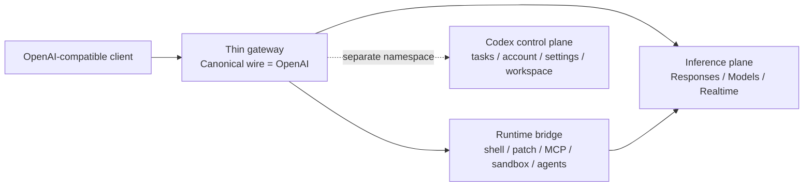
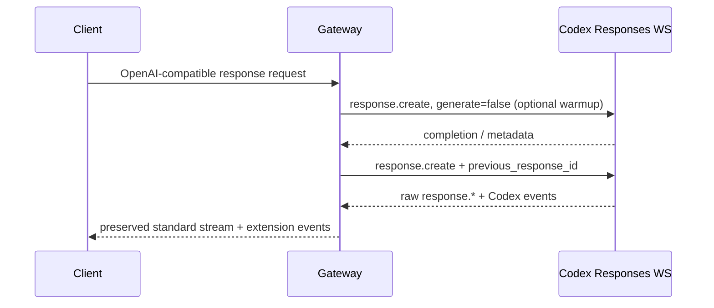
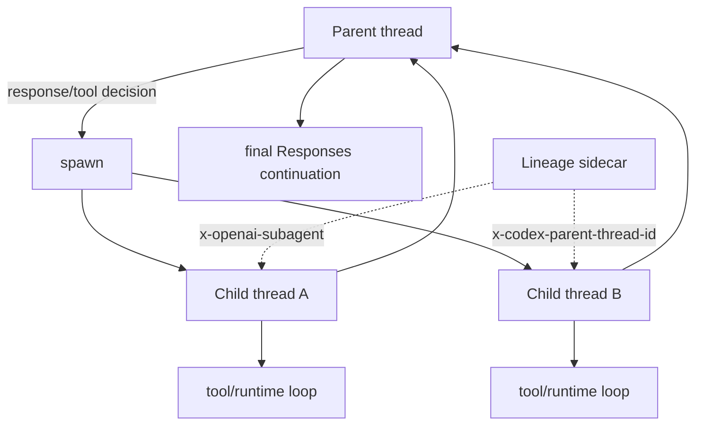

# Codex Contract Atlas: OpenAI-Compatible Gateway Research Snapshot

## Executive summary

I treated the attached mission brief as the actual research topic: **map the canonical OpenAI API contract to the contract and runtime behavior used by Codex, then use that evidence to design an OpenAI-compatible gateway with minimum translation and maximum Codex capability retention**. This follows the brief’s explicit principles of “zero-copy whenever possible,” preserving unknown fields/events/headers instead of silently discarding them, separating backend behavior from Codex runtime behavior, and beginning with the dataset before building the documentation UI. fileciteturn0file0

The main architectural conclusion is strong:

> **Use the official OpenAI Responses wire as the canonical public and internal inference representation. Do not insert a bespoke intermediate message format unless a capability genuinely requires one.**

The evidence for this is unusually favorable. The official Codex `ResponsesApiRequest` already carries OpenAI-shaped fields such as `model`, `instructions`, `input`, `tools`, `tool_choice`, `parallel_tool_calls`, `reasoning`, `store`, `stream`, `stream_options`, `include`, `service_tier`, `prompt_cache_key`, and `text`. Its WebSocket conversion largely reuses those fields and adds continuation/runtime-specific members such as `previous_response_id` and `generate`. citeturn21search1turn21search2 The canonical OpenAI specification independently defines `/responses`, retrieval, deletion, cancellation, input-item listing, input-token counting, and compaction. citeturn12view0turn12view1turn12view2turn12view3turn11view0turn11view1

A second conclusion is equally important: **lossless transport must exist below or alongside Codex's typed parsers.** The official Codex SSE parser deliberately recognizes but does not project several legitimate wire events—including `response.in_progress`, `response.metadata`, `response.output_text.done`, function-call argument events, `codex.response.metadata`, and WebSocket timing events—into its internal typed event representation. Unknown `.delta` events can likewise be traced rather than surfaced. A gateway whose only representation is that typed projection would therefore be structurally capable of losing upstream information. citeturn21search0

A third conclusion is that the target is not one monolithic “Codex API.” It consists of at least three domains:



The **inference plane** is the best candidate for pass-through. The **runtime** owns local execution such as process management, PTYs, sandboxing, approvals and `apply_patch`. citeturn5search0turn5search4turn5search12 The **Codex control plane** is separately implemented by `codex-rs/backend-client` and explicitly contains `/wham/tasks`, `/wham/accounts/check`, `/wham/profiles/me`, `/wham/workspace-messages`, `/wham/settings/user`, `/wham/config/bundle`, and related routes. citeturn16view0turn16view1turn16view2turn16view3 It should not be made a dependency of basic OpenAI-compatible inference.

I also produced a working **data-driven documentation prototype** containing **119 mapping entries**, source provenance, confidence levels, roadmap lots, risks and verification procedures:

**[Download the complete Codex Contract Atlas project](sandbox:/mnt/data/codex-contract-atlas.zip)**

**[Open the generated site entry point](sandbox:/mnt/data/codex-contract-atlas/index.html)**

**[Download the structured mapping dataset](sandbox:/mnt/data/codex-contract-atlas/data/mappings.json)**

**[Download the flat CSV audit view](sandbox:/mnt/data/codex-contract-atlas/data/mappings.csv)**

The artifact is intentionally labeled a **research snapshot rather than “100% complete.”** The two principal missing prerequisites for making that claim are an exact pinned SHA for both upstream repositories at the cutoff and an automated resolver/differ that completely expands `$ref`, `allOf`, `oneOf`, `anyOf`, inheritance and nested unions. The public OpenAPI repository is generated from an upstream specification and changes frequently; its visible September 2026 history includes multiple schema changes within days. citeturn17search3turn18view1 Codex was likewise changing rapidly in September, including context snapshots, voice, plugin settings, access-program discovery and related runtime behavior. citeturn19view0

## Scope, assumptions, and evidence model

### What was assumed

The uploaded specification is treated as authoritative for desired scope. That means generic Files API and video are excluded, while local files used by the Codex runtime remain in scope; Responses, Models, WebSockets/SSE, Realtime, audio, images, reasoning, structured output, tools, MCP, Apps/connectors, plugins, skills, hooks, multi-agent, memory, compaction, approvals, sandboxing, threads/turns, Codex control plane, model metadata and authentication are included. fileciteturn0file0

The research cutoff is **September 19, 2026, Europe/Paris**. The canonical OpenAI repository identifies itself as a machine-readable OpenAPI 3.1 specification; the researched generated document identifies the API server under `/v1`. citeturn17search3turn10view0

One material limitation is repository pinning. The OpenAPI commit page visible through the research crawler showed `b5362da` on September 10 as its newest visible entry even though GitHub indicated subsequent repository activity; the Codex commit page exposed `89c8bcf` on September 12 while the live source files were crawled later. I therefore **did not falsely record those short hashes as the exact September 19 HEADs**. They are stored in the dataset as “nearest visible commit,” while exact SHA is `UNKNOWN`. citeturn18view1turn19view0

### Evidence hierarchy

The dataset follows the hierarchy requested in the brief:

| Evidence | Role in conclusions | Default confidence |
|---|---|---:|
| `openai/openai-openapi` | Canonical public wire contract | CONFIRMED |
| `openai/codex` source and tests | Official Codex implementation behavior | CONFIRMED / HIGH |
| Official OpenAI developer documentation | Runtime semantics, supported public workflows | CONFIRMED / HIGH |
| Official issues/PRs | Drift, bugs, behavior not fully represented by schemas | MEDIUM / HIGH |
| Community reverse engineering | Discovery and hypothesis generation only | LOW unless corroborated |

This distinction matters. For example, OpenAI publicly supports built-in tools, MCP tools/connectors and custom function tools in Responses. citeturn22search4turn22search8 Community observations can tell us that a particular proxy needed to preserve a header or an opaque compaction item, but that observation is not promoted to canonical contract unless the official code or public specification independently supports it.

### Key questions and hypotheses

The research is organized around four testable hypotheses.

**The first is that most Responses inference traffic can pass 1:1.** Official Codex source strongly supports this: its request object has an OpenAI-like schema, tools are retained as raw JSON rather than rebuilt into a narrower generic tree, and its WebSocket request is produced directly from the same object. citeturn21search1

**The second is that the main incompatibilities are state and execution, not basic message formatting.** Codex introduces turn state, model-catalog ETags, server-model metadata, subagent lineage, installation/window metadata and local tool execution. citeturn21search5turn21search2 Those can be modeled as headers/state sidecars and a runtime interface rather than as a wholesale request-body translation.

**The third is that model support must be discovered dynamically.** Codex's Models Manager obtains remote catalogs through `list_models(client_version, …)`, caches them, partitions them by provider/auth identity and treats visible ChatGPT/API-key catalogs as authoritative in relevant cases. citeturn14search0turn15view5 Its `ModelInfo` representation contains considerably more capability metadata than the basic OpenAI `/models` resource. The gateway should therefore retain a rich internal catalog and project the standard OpenAI model shape outward, rather than reduce the upstream catalog permanently.

**The fourth is that App Server is valuable as a contract/runtime source but should not automatically become the inference gateway’s mandatory middle layer.** This is an architectural inference from the fact that Codex already contains a lower-level OpenAI-shaped API client, while runtime execution and higher-level application orchestration live in separate modules. citeturn21search1turn5search0turn5search4

## Contract findings and capability mapping

### Responses is the strongest pass-through surface

The canonical API has `POST /v1/responses` with `CreateResponse` as its request model and either a `Response` or streamed response-event sequence as output. It also exposes retrieve, delete, cancel, input-item listing, token counting and compaction operations. citeturn12view0turn12view1turn12view2turn12view3turn11view0turn11view1

On the Codex side, the core request is already very close:

| Field | OpenAI | Codex OSS | Recommended gateway action |
|---|---|---|---|
| `model` | Standard Responses field | `ResponsesApiRequest.model` | **1:1 PASS-THROUGH** |
| `instructions` | Standard | Same | **1:1 PASS-THROUGH** |
| `input` | Response input-item sequence | `Vec<ResponseItem>` | **1:1, preserve ordering and opaque items** |
| `tools` | Public tool union | Raw serialized JSON in Codex | **Raw pass-through preferred** |
| `tool_choice` | Evolving public union | Codex request field | **Pass through raw; avoid narrowing** |
| `parallel_tool_calls` | Standard | Same | **1:1** |
| `reasoning` | Standard reasoning control | Codex `Reasoning` | **1:1 core + preserve Codex extensions** |
| `store` | Standard | Same | **1:1** |
| `stream` / `stream_options` | Standard | Same | **1:1** |
| `include` | Standard | Same | **1:1** |
| `service_tier` | Standard | Same | **1:1** |
| `prompt_cache_key` | Standard | Same | **1:1** |
| `text` | Structured-output/verbosity controls | Same concept | **1:1** |
| `client_metadata` | Not a core standard equivalent in this shape | Codex extension | **Preserve extension** |
| `access_programs` | Codex-oriented extension | Codex field | **Preserve extension** |

The Codex source directly substantiates this mapping. Its tool collection is represented as raw JSON specifically to avoid rebuilding the value tree, which is a useful design precedent for the proposed gateway. citeturn21search1

There is one important caution: **“same field today” must not become “typed allowlist forever.”** An official Codex issue from August 2026 points out that newer prompt-caching fields can be representable in the canonical API while missing from some Codex typed structures. That is exactly the kind of schema-lag that a raw pass-through layer avoids. citeturn21search4

For conversation continuity, canonical OpenAI supports `previous_response_id`, and official SDK guidance emphasizes retaining complete ordered output items when manually replaying state rather than selectively dropping reasoning or tool material. citeturn7search6 Codex's WebSocket structure explicitly adds `previous_response_id`, making incremental continuation a direct mapping rather than a reason for a custom conversation format. citeturn21search1

### Streaming must be dual-representation

The safest implementation is:

```text
upstream SSE / WS frame
          │
          ├────────────► raw lossless forwarding / storage
          │
          └────────────► optional typed projection
                           for orchestration,
                           metrics, runtime control
```

This is not merely defensive programming. Codex's official parser currently treats several known events as “unhandled” for its typed event projection, including `codex.response.metadata`, `response.content_part.*`, `response.custom_tool_call_input.done`, function-call argument events, `response.in_progress`, `response.metadata`, `response.output_text.done`, `response.reasoning_summary_part.done`, and `responsesapi.websocket_timing`. It also has a generic branch for otherwise-unhandled delta events. citeturn21search0

At the same time, it does explicitly project important events such as output-item completion, output-text deltas, custom-tool-call input deltas and reasoning-summary parts. citeturn21search0 The result is that the typed parser is excellent for the Codex runtime, but **not sufficient as the sole wire representation for a zero-loss gateway**.

The site consequently marks `response.metadata`, `codex.response.metadata`, WebSocket timing and similar items with explicit preservation requirements.

### Responses WebSocket is stateful but still OpenAI-shaped

Codex's WebSocket implementation sends a tagged `response.create` request. Its request includes the main Responses fields plus `previous_response_id`, `generate`, and client metadata. citeturn21search1turn21search2 The core client uses a best-effort prewarm mechanism in which `generate=false` establishes/warmups a connection so that a subsequent request can reuse state and continuation mechanisms. The implementation also carries an internal Responses-WebSocket beta negotiation value. citeturn21search5

The relevant Codex state should therefore be treated as **transport state around the canonical request**, not rewritten into a proprietary conversation object:



The implementation exposes `x-codex-turn-state`, `X-Models-Etag`, `X-Reasoning-Included`, and `OpenAI-Model` as meaningful response/header state. citeturn21search2turn21search5 These belong in a state/header sidecar, not inside a lossy transformed message format.

### Models should have a standard projection and a rich extension

Canonical `/v1/models` is intentionally simple. Codex's catalog is much richer, and its model manager fetches a remote catalog through a provider-specific `ModelsEndpointClient`, with client-version awareness, ETag handling, identity-scoped caching and fallback behavior. citeturn14search0turn15view5

This leads to a two-layer model API:

```text
GET /v1/models
    └─ standard OpenAI-compatible projection

GET /v1/codex/models   (or extension metadata on each object)
    └─ rich ModelInfo capability catalog
```

The rich layer should retain fields such as input modalities, reasoning choices, context limits, auto-compaction thresholds, support for parallel calls/search/image details, WebSocket preference, tool modes, multi-agent behavior, service tiers and plan availability where present in the current catalog. The protocol code explicitly describes `ModelInfo` as backend model metadata, and the model manager distinguishes genuine remote information from fallback metadata. citeturn13view3turn4search3

This is the correct place to answer “does model X actually support feature Y?” rather than hard-coding model names into gateway logic.

### Realtime, images and audio should remain canonical surfaces

OpenAI's current Realtime public surface includes `POST /realtime/calls` for WebRTC and `POST /realtime/client_secrets` for ephemeral browser/mobile credentials. citeturn22search10turn22search0 Current GA guidance uses `/v1/realtime/calls` for WebRTC rather than the older beta pattern. citeturn22search3

Codex core independently has a `/realtime/calls` bootstrap path and sideband orchestration. It can apply a supported attestation value on relevant flows. That should be documented as an observable supported security mechanism, **not imitated, forged or bypassed**. citeturn6search1turn21search5

OpenAI's standard audio surface includes speech, transcription and translation endpoints, with speech capable of direct audio or SSE streaming. citeturn22search1turn22search6 OpenAI's image stack supports both the Image API and image generation through Responses, including partial-image streaming. citeturn22search16

The currently unresolved question is **not whether those public OpenAI contracts exist; it is whether every one is reachable using the same ChatGPT/Codex subscription backend and model/account combination**. That distinction is marked `UNKNOWN` in the dataset rather than guessed.

### Tools divide naturally into backend-native and runtime-local capabilities

OpenAI Responses currently has a broad tool model covering built-ins, MCP/connectors and user-defined calls. citeturn22search4turn22search8 Codex then adds an execution runtime around model-generated calls.

A useful classification is:

| Capability | Best classification | Gateway implication |
|---|---|---|
| Function/custom calls | `OPENAI_STANDARD` | Preserve tool schema and calls 1:1 |
| Web search | `BACKEND_NATIVE` | Forward as hosted tool; capability-gate by model |
| Image generation | `BACKEND_NATIVE` | Forward standard Responses tool/events |
| Remote MCP | `OPENAI_STANDARD` / `HYBRID` | Preserve standard wire; runtime may own credentials/execution |
| Shell / PTY | `RUNTIME_LOCAL` | Requires Codex runtime bridge |
| `apply_patch` | `RUNTIME_LOCAL` | Requires runtime + approval/sandbox policy |
| Code Mode / local execution host | `RUNTIME_LOCAL` | Feature/runtime-specific |
| Browser/computer execution | `HYBRID` | Do not equate hosted computer-use wire with local browser execution |
| Skills/plugins/hooks | `RUNTIME_LOCAL` / product extension | Extension capability registry |
| Subagents/review | `HYBRID` | Thread/runtime orchestration + lineage metadata |
| Memory consolidation | `CODEX_EXTENSION` / `HYBRID` | Separate extension endpoint/runtime |
| Compaction | `HYBRID` | Public compact wire plus Codex-specific orchestration |

Codex's execution subsystem explicitly integrates command execution with approvals and sandboxing, while `apply_patch` has its own runtime handler. citeturn5search0turn5search4turn5search12 That is why translating shell into a backend-specific pseudo-endpoint would be the wrong abstraction: the backend generates a tool call; **the runtime executes it**.

## State, extensions, and control-plane boundaries

### Headers should be classified instead of normalized indiscriminately

The header layer is one of the few places where a thin gateway genuinely needs adaptation.

The current Codex client defines or consumes headers such as:

| Header / metadata | Proposed handling | Role |
|---|---|---|
| `Authorization` | Controlled replacement/passthrough | Authentication |
| `ChatGPT-Account-ID` | Codex adapter | Account/workspace routing |
| `User-Agent` | Preserve/identify gateway | Client identity |
| `x-client-request-id` | Preserve/generate only under documented policy | Correlation |
| `x-openai-subagent` | Preserve | Agent lineage |
| `x-codex-parent-thread-id` | Preserve | Parent-child lineage |
| `x-codex-turn-state` | **Store and replay only in its valid scope** | Sticky turn state |
| `x-codex-turn-metadata` | Preserve opaque | Runtime/turn metadata |
| `x-codex-window-id` | Preserve | Context/window identity |
| `OpenAI-Model` | Expose as response metadata | Server-selected model |
| `X-Models-Etag` | Consume + preserve | Dynamic model refresh |
| `X-Reasoning-Included` | Consume + preserve | Reasoning metadata |
| `x-request-id` | End-to-end observability | Request tracing |
| `OpenAI-Beta` | Explicit protocol negotiation | Beta versions |
| `x-oai-attestation` | **Supported producer only; never synthesize** | Security/attestation |

Current Codex source defines several of these constants directly, including turn state, parent thread ID, subagent metadata, installation/window metadata and an internal Responses WebSocket beta value. citeturn21search5 Its WebSocket endpoint separately extracts model, reasoning and catalog ETag information from server responses. citeturn21search2

Authentication itself is also heterogeneous. Codex protocol source distinguishes API-key, managed ChatGPT authentication, externally supplied ChatGPT tokens, header-based provider auth and other identity modes; its login manager separately handles OAuth refresh. citeturn6search3turn6search8 This argues for an **auth-provider interface around the transport**, not for mutating inference schemas based on auth mode.

### Compaction and memory require opaque preservation

OpenAI now has a canonical `POST /responses/compact` resource. citeturn11view0turn11view2 Codex also contains remote compaction logic and, in newer work, an alternate flow using a `compaction_trigger` input through ordinary Responses. A third-party issue documenting that mechanism points back to official Codex source and is useful corroborating evidence, but its details remain lower confidence than the canonical OpenAI endpoint until the exact current Codex SHA is pinned and the source is mechanically extracted. citeturn21search3turn21search6

The implementation rule should nevertheless already be firm:

> **A compaction item, encrypted reasoning artifact or other opaque continuation object is protocol state, not “content to clean up.” Persist and replay it unchanged.**

Similarly, Codex exposes `/memories/trace_summarize` through its core client, with memory input/output types in the Codex API layer. citeturn6search1turn13view0 This is a Codex extension and should be exposed under an extension namespace rather than being falsely presented as a standard OpenAI endpoint.

### Multi-agent is a graph above the basic Responses transport

Codex multi-agent functionality involves parent and child threads, spawn/review semantics and request-kind metadata; its source derives subagent header values such as `review`, `compact`, `memory_consolidation` and `collab_spawn`. citeturn6search6 Official issue history also shows that subagent event and parent-turn metadata handling has been evolving across App Server/Desktop surfaces, which means it should not be flattened prematurely into one stable public schema. citeturn5search7turn5search16

The recommended structure is therefore:



The raw OpenAI-compatible transport can remain intact underneath this graph. Multi-agent orchestration then lives above it rather than contaminating every Responses request with a custom gateway IR.

### Codex inference and Codex control plane should be separate products internally

The official backend client gives unusually clear evidence here. Depending on host style it maps task listing to `/api/codex/tasks/list` or `/wham/tasks/list`, task detail to corresponding task routes, and sibling-turn access to nested task/turn routes. citeturn16view0 The same client independently implements account checks and user profile/usage routes. citeturn16view1turn16view3 It also has config bundle, settings and workspace-message routes. citeturn16view2

That warrants a hard boundary:

```text
/v1/responses
/v1/models
/v1/realtime/*
/v1/audio/*
/v1/images/*
        │
        └── OpenAI-compatible inference API

/v1/codex/runtime/*
        │
        └── explicit runtime extensions

/v1/codex/control/*
        │
        └── optional Codex cloud/control-plane adapter
```

This reduces maintenance coupling and means the useful core gateway can ship without depending on private cloud-task semantics.

## Evaluation method, architectural alternatives, and risks

### How compatibility should be measured

A gateway like this should not be judged by endpoint count alone. The dataset uses six more useful measurements:

**Wire coverage** measures how many OpenAI request/response members can traverse byte-for-byte or structurally unchanged.

**Losslessness** tests whether arbitrary unknown members, unknown SSE events, unknown WS event types, response headers and opaque response items survive a round trip.

**Capability coverage** measures backend-native and runtime capabilities separately; “shell supported” is not equivalent to “shell is a server endpoint.”

**State fidelity** covers `previous_response_id`, turn state, prompt caching, response IDs, opaque compaction state, session/window identity and parent/subagent lineage.

**Dynamic capability fidelity** tests whether model-specific behavior comes from the live model catalog rather than static name checks. Codex's own model manager already has online refresh, identity partitioning and ETag/cache behavior that can be used as a reference implementation. citeturn14search0turn15view5

**Schema drift detection** compares the newly resolved canonical OpenAPI graph to the pinned Codex request/event models on every upstream upgrade. This is especially important because both repositories were changing frequently during the September 2026 research window. citeturn18view1turn19view0

The minimum regression suite should therefore inject synthetic extension fields at **every nesting level**, unknown tools, unknown output items, unknown event names and unknown headers, then verify identity after proxying. It should also replay stored opaque items through subsequent turns.

### Architectural alternatives

The following scores are analytical engineering assessments, not measurements published by OpenAI.

| Architecture | Translation burden | Loss risk | Runtime access | Drift exposure | Recommendation |
|---|---:|---:|---:|---:|---|
| **Raw OpenAI Responses wire + thin Codex adapter** | **1/5** | **1/5** | 5/5 via separate bridge | 2/5 | **Recommended** |
| App Server as mandatory gateway middle layer | 3/5 | 2–3/5 | **5/5** | 3/5 | Good orchestration adapter, not ideal universal wire |
| Bespoke normalized gateway IR | **5/5** | **5/5** | 4/5 | **5/5** | Avoid |
| Community-proxy-compatible imitation | 3/5 | 4/5 | 2–4/5 | **5/5** | Useful for discoveries/tests only |
| Simple blind HTTP reverse proxy | **1/5** | 1/5 | 1/5 | 2/5 | Too little state/runtime logic |

The first option wins because official Codex already consumes an OpenAI-shaped Responses request, while the parts that genuinely need special handling—tool execution, approvals, sandboxing, sticky state, richer model metadata and control-plane operations—have identifiable boundaries of their own. citeturn21search1turn21search5turn5search0

### Principal risks

The largest **compatibility risk** is typed-schema lag. OpenAI's public schema evolves quickly, while a pinned Codex client can temporarily lack a newly added field. A strict `deserialize → reserialize` gateway can therefore lose a perfectly valid field even when the upstream server would accept it. Recent prompt-cache field discussions illustrate this class of problem. citeturn21search4

The largest **state risk** is treating transport-derived state as globally reusable. Turn state, previous-response continuation, parent/subagent identity, model-catalog ETags and context-window identity have different lifetimes. Codex itself scopes turn-state handling within its client/session behavior. citeturn21search5

The largest **security risk** is crossing the runtime boundary casually. Shell execution, patching, network access and MCP tools have approval and sandbox semantics for a reason; exposing them as unrestricted proxy endpoints would discard the runtime's security model. citeturn5search0turn5search2 Attestation is another explicit boundary: documented behavior can be forwarded, but the gateway should not manufacture values or provide an attestation-bypass mechanism. citeturn6search1

The largest **maintenance risk** is the control plane. `/wham/*` is implemented in official source, but it is product-specific and substantially less necessary for basic OpenAI-compatible inference than Responses/Models. citeturn16view0turn16view1turn16view2

The largest **research uncertainty** remains exact current product parity. A protocol can be present in OpenAPI, a model can support a modality, and a ChatGPT/Codex product plan can still expose different combinations. Those three questions—protocol support, model support and product/account support—must remain separate.

## Implementation roadmap and actionable recommendations

The project should proceed in the requested lot order, but with explicit go/no-go criteria.

| Lot | Deliverable | Coverage gained | Implementation | Main risk |
|---|---|---|---:|---|
| **Responses Core** | Raw HTTP/SSE Responses proxy | Text, reasoning, structured output, calls, image input | 2/5 | Schema narrowing |
| **Models + capabilities** | Live rich catalog + OpenAI projection | Dynamic modality/tool/reasoning gating | 2/5 | Catalog/schema drift |
| **Advanced Responses** | State, compact, cache, hosted tools | Long-running/resumable sessions | 3/5 | Opaque-state loss |
| **Responses WebSocket** | `response.create`, continuation, warmup | Low-latency stateful inference | 3/5 | Connection/state lifetime |
| **Images + Audio** | Standard media endpoints | Broad multimodal API | 3/5 | Product-route availability |
| **Realtime** | WS/WebRTC bridge | Voice + continuous audio | 5/5 | Protocol/version/auth complexity |
| **Runtime tools** | Trusted executor service | Shell, patch, filesystem, browser/computer | 5/5 | Sandbox/security |
| **Extensibility** | MCP/plugins/skills/hooks registry | External tools and packages | 4/5 | Credential/isolation complexity |
| **Agent runtime** | Thread graph and subagent orchestration | Review/multi-agent/memory | 5/5 | Fast-evolving semantics |
| **Control plane** | Optional Codex cloud adapter | Tasks/account/workspace parity | 5/5 | Private-product drift |

The immediate implementation recommendation is to make **Lot Responses Core deliberately boring**:

```text
incoming request
   │
   ├─ validate non-destructively
   ├─ retain original body
   ├─ adapt only destination/auth/routing state
   ▼
upstream request

upstream response
   │
   ├─ copy body/events losslessly
   ├─ observe typed events in parallel
   ├─ capture approved state headers
   ▼
client
```

That design directly reflects the fact that Codex's request contract is already substantially OpenAI-shaped. citeturn21search1

The next priority should be **model discovery**, before adding more hard-coded capabilities. Codex's model manager already demonstrates why: remote discovery, ETag handling, provider/auth identity and fallback metadata all affect what is actually available. citeturn14search0

The third priority is a **schema-drift CI pipeline**. At every dependency bump it should:

1. Pin the exact 40-character SHA of `openai/openai-openapi` and `openai/codex`.
2. Resolve every `$ref`, `allOf`, `oneOf`, `anyOf` and inheritance path in the canonical OpenAPI.
3. Generate flattened field/event/tool inventories.
4. Extract the Codex Rust/API/App Server schemas at the pinned SHA.
5. Produce machine-readable `same / OpenAI-only / Codex-only / structurally-different`.
6. Run serialization fixtures proving unknown-field/event preservation.
7. Block release when a previously pass-through field becomes narrowed or silently discarded.

That is the missing automation required to transform the current high-confidence research seed into the **exhaustive audit** envisioned in the brief.

For traffic research, the safest next experiment is the one already favored by the supplied specification: instrument a pinned official Codex client or place a local recorder in front of it, redact bearer credentials, and capture method, path, query, request headers/body, response headers, SSE events, WebSocket frames and timing. fileciteturn0file0 This should be used to resolve only the cells still marked `UNKNOWN`, rather than to replace source analysis with broad reverse engineering.

## Deliverables, remaining unknowns, and completion criteria

The generated prototype is a **real static documentation application backed by data rather than hardcoded mapping components**. It has persistent documentation navigation, global search, mapping-category tabs, compatibility filters, confidence/complexity badges, a detail drawer with provenance, light/dark/system theming, architecture documentation, roadmap views, unknown/verification cards, source links, JSON export and a CSV audit view.

The primary artifact is:

**[Codex Contract Atlas — complete ZIP](sandbox:/mnt/data/codex-contract-atlas.zip)**

Its principal files are:

| Deliverable | Artifact |
|---|---|
| Interactive documentation site | [index.html](sandbox:/mnt/data/codex-contract-atlas/index.html) |
| Structured mapping dataset | [mappings.json](sandbox:/mnt/data/codex-contract-atlas/data/mappings.json) |
| Flat mapping/audit export | [mappings.csv](sandbox:/mnt/data/codex-contract-atlas/data/mappings.csv) |
| Research/architecture notes | [research-notes.md](sandbox:/mnt/data/codex-contract-atlas/research-notes.md) |
| Run/development instructions | [README.md](sandbox:/mnt/data/codex-contract-atlas/README.md) |

The most consequential unresolved items are intentionally visible rather than hidden:

| Unknown | Current confidence | Exact verification |
|---|---|---|
| Exact September 19 upstream HEAD SHAs | UNKNOWN | `git ls-remote`/networked CI, record full hashes and schema digest |
| Codex-subscription parity for retrieve/delete/cancel/input-items | UNKNOWN | Create persisted response through official route and probe each operation |
| Exact current Responses WS negotiation/handshake matrix | MEDIUM | Instrument current pinned official transport, redact auth |
| Realtime V1/V2/V3 / Frameless Bidi / handoff variants | LOW–MEDIUM | Enumerate pinned source/generated App Server schemas + official call traces |
| Standalone Images/Audio access through ChatGPT Codex auth | UNKNOWN | Capability-gated authenticated probes per plan/model |
| Browser/computer plugin contract vs hosted computer-use tool | MEDIUM | Extract plugin manifests/tool definitions and compare with OpenAI tool schema |
| Multi-agent v2 lineage/event completeness | MEDIUM | Parent/child trace from current CLI/Desktop plus App Server event diff |
| Complete newer prompt-cache field preservation through typed Codex | MEDIUM | Resolved schema diff + serialization golden tests |

These uncertainties are material because both canonical OpenAI and Codex were still changing rapidly near the cutoff. OpenAI's September commit history includes recent changes to image-generation schemas, prompt caching and compaction-related types, while Codex's visible September history includes context snapshots, voice, plugins and access-program discovery. citeturn18view1turn19view0

The criterion for declaring the project **complete** should therefore be stronger than “the site has a page for every feature.” For each major capability, the dataset must be able to answer all of the following from machine-readable evidence:

> **Which public endpoint exposes it? Which resolved schema governs it? Which fields pass 1:1? Which require adaptation? Which headers/state are involved? Is execution backend-native or runtime-local? Which live model metadata gates it? What is the implementation complexity and roadmap lot? What exact source, file, symbol and pinned SHA proves the conclusion?**

The present snapshot establishes the architecture, the provenance model, the first 119 structured mappings and the interactive documentation foundation. It also establishes the most important engineering decision: **the lowest-loss gateway is not “OpenAI → custom IR → App Server → Codex”; it is “OpenAI wire → Codex/OpenAI wire directly, with state and runtime attached only where genuinely necessary.”** That conclusion is supported by the official Codex request representation, its separate runtime subsystems, its dynamic model manager and its distinct backend control-plane client. citeturn21search1turn5search0turn14search0turn14search2